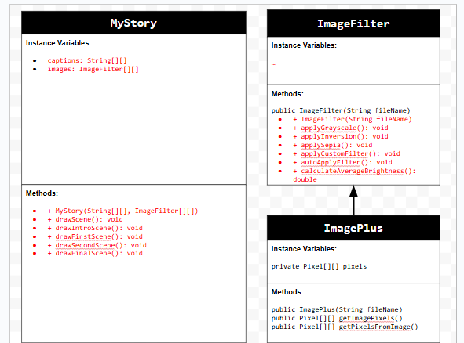
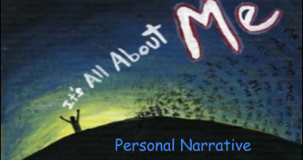

# Project-Personal-Narrative
# Unit 4 - Personal Narrative

## Introduction

Images are often used to portray our personal experiences and interests. We also use image filters and effects to change or enhance the mood of an image. When combined into collages and presentations, these images tell a story about who we are and what is important to us. Your goal is to create a personal narrative using The Theater that consists of images of your personal experiences and/or interests, incorporates data related to these experiences and/or interests that can be organized in a 2D array, and uses image filters and effects to change or enhance the mood of your images.

## Requirements

Use your knowledge of object-oriented programming, two-dimensional (2D) arrays, and algorithms to create your personal narrative collage or animation:

- **Create at least two 2D arrays** – Create at least two 2D arrays to store the data that will make up your visualization.
- **Implement one or more algorithms** – Implement one or more algorithms that use loops and two-way or multi-selection statements with compound Boolean expressions to analyze the data.
- **Use Image Filters** - Include multiple image filters learned from this unit, and additionally create new ones of your own.
- **Use methods in the String class** – Use one or more methods in the String class in your program, such as to determine whether the name of an image file contains specific characters.
- **Create a visualization** – Create an image or animation that conveys the story of the data by illustrating the patterns or relationships in the data.
- **Document your code** – Use comments to explain the purpose of the methods and code segments and note any preconditions and postconditions.

## UML Diagram

Put and image of your UML Diagram here. Upload the image of your UML Diagram to your repository, then use the Markdown syntax to insert your image here. Make sure your image file name is one work, otherwise it might not properly get display on this README.

## Video

Record a short video of your story to display here on your README. You can do this by:

- Screen record your project running on Code.org.
- Upload that recording to YouTube.
- Take a thumbnail for your image.
- Upload the thumbnail image to your repo.
- Use the following markdown

([youtube-URL-here](https://www.youtube.com/watch?v=2WHBtaWvsb8))

## Story Description

Write a description of the story that your animation showcases. Give addional context for your story here in the case your animation is more abstract and only has images and little text. Lastly, include what data in your project is represented in 2D arrays and how those directly relate to the story your animation showcase.

Answer - My animation is basically a mini scrapbook of four upcoming moments that will soon mean a lot to me—chilling at Sunset Beach, a fun Family Picnic, the huge milestone of Graduation Day, and an adventurous Hiking Trip. All of these are activities i want to experience after the stressful process of college applications. Each scene has its own vibe, from the calm, peaceful beach to the excitement of finally graduating. The filters and transitions help set the mood, making it feel more like flipping through memories rather than just random pictures.

To make all this work, I used two 2D arrays. One stores the captions (String[][]), so each image has the right text description that matches the scene. The other one stores the images (ImageFilter[][]), which makes it easier to apply different filters to match the mood of each moment—like making the beach scene warmer or the hiking scene more dramatic. This setup keeps everything structured and makes the animation flow smoothly.

## Image Filter Analysis

Choose at least 2 filters uses in your animation to explain how the pixels are modified. If you created a new image filter that was not one of the ones from this unit, make sure to explain and analyze that filter(s) before choosing ones that came from this unit.

Answer - One of the filters I used is the Grayscale Filter, which converts an image into black and white by averaging the red, green, and blue (RGB) values of each pixel. This makes the image look more classic and timeless by removing all color and focusing only on light and dark shades.

The other filter I created is a Custom Brightness-Adjusting Filter, which checks how bright an image is and adjusts it accordingly. If the image is too dark, it increases the brightness by adding a set value to each pixel’s RGB values. If it’s too bright, it lowers the brightness by decreasing those values. This helps balance out the image and make it look clearer in the animation.